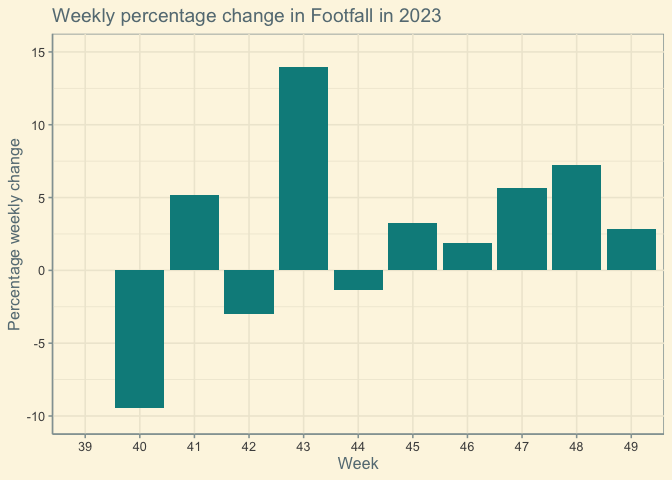
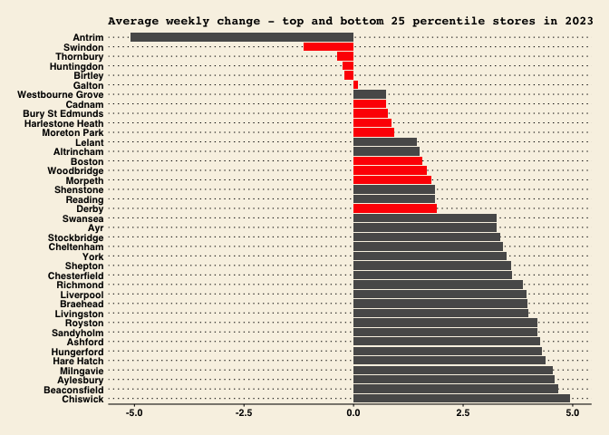

    rm(list = ls())
    setwd("~/Desktop/EssenceMedia/Submission")
    media <- read.csv("Media.csv") 
    footfall <- read.csv("Business.csv")

    library(ggplot2)
    library(tidyr)
    library(dplyr)

    ## 
    ## Attaching package: 'dplyr'

    ## The following objects are masked from 'package:stats':
    ## 
    ##     filter, lag

    ## The following objects are masked from 'package:base':
    ## 
    ##     intersect, setdiff, setequal, union

    library(ggthemes)
    library(scales)
    library(maps)
    library(viridis)

    ## Loading required package: viridisLite

    ## 
    ## Attaching package: 'viridis'

    ## The following object is masked from 'package:maps':
    ## 
    ##     unemp

    ## The following object is masked from 'package:scales':
    ## 
    ##     viridis_pal

    sum(is.na(footfall))

    ## [1] 0

    sum(is.na(media$Week))

    ## [1] 0

    n_distinct(footfall$Store.ID)

    ## [1] 77

    n_distinct(footfall$Store)

    ## [1] 77

    #Dividing the datasets into two periods, 2022 and 2023
    footfall_2022 <- footfall %>%
      filter(Year==2022)

    footfall_2023 <- footfall %>%
      filter(Year==2023)

# ANALYSIS FOR 2022

\#1. DATA EXPLORATION \#1.1 FOOTFALL TRENDS

    #Total footfall by week 
    footfall_total1 <- footfall_2022 %>%
      group_by(Week) %>%
      summarise(total_footfall=sum(Footfall))

    footfall_total2 <- footfall_2023 %>%
      group_by(Week) %>%
      summarise(total_footfall=sum(Footfall))

    ggplot(footfall_total1, aes(x=factor(Week), y=total_footfall), colour=clarity) + 
      geom_bar(stat="identity") +
      xlab("Week") +
      ylab("Total Footfall") +
      theme_solarized()+
      ggtitle("Weekly Footfall in 2022")+
      scale_y_continuous(labels = label_number(suffix = " K", scale = 1e-3), limits = c(0, 800000))

    ggplot(footfall_total2, aes(x=factor(Week), y=total_footfall), colour=clarity) + 
      geom_bar(stat="identity") +
      xlab("Week") +
      ylab("Total Footfall") +
      theme_solarized()+
      ggtitle("Weekly Footfall in 2023")+
      scale_y_continuous(labels = label_number(suffix = " K", scale = 1e-3), limits = c(0, 800000))

# PERCENTAGE CHANGE IN FOOTFALL

    # Percentage footfall change by week
    footfall_change1 <- footfall_total1 %>% 
      mutate(PctChange = (total_footfall - lag(total_footfall))/lag(total_footfall) * 100)

    footfall_change2 <- footfall_total2 %>% 
      mutate(PctChange = (total_footfall - lag(total_footfall))/lag(total_footfall) * 100)

    ggplot(footfall_change1, aes(x=factor(Week), y=PctChange)) + 
      geom_bar(stat="identity") +
      xlab("Week") + 
      ylab("Percentage Change") +
      ggtitle("Weekly percentage change in Footfall in 2022")+
      theme_solarized()+
      labs(y="Percentage weekly change")+
      scale_y_continuous(limits = c(-7.5, 15))

    ## Warning: Removed 1 rows containing missing values (`position_stack()`).

    ggplot(footfall_change2, aes(x=factor(Week), y=PctChange))+ 
      geom_bar(stat="identity",  fill="cyan4") +
      xlab("Week") + 
      ylab("Percentage Change") +
      ggtitle("Weekly percentage change in Footfall in 2023")+
      theme_solarized()+
      labs(y="Percentage weekly change")+
      scale_y_continuous(limits = c(-10, 15))

    ## Warning: Removed 1 rows containing missing values (`position_stack()`).

\#TOP 5 STORES IN TERMS OF FOOTFALL

    # CHANGE IN FOOTFALL IN EACH STORE 
    footfall_by_week <- footfall %>%
      summarise(total_footfall=sum(Footfall), .by=c(Store,Year, Week))
      
    footfall_by_week1 <- footfall_2022 %>%
      summarise(total_footfall=sum(Footfall), .by=c(Store,Week))

    footfall_by_week2 <- footfall_2023 %>%
      summarise(total_footfall=sum(Footfall), .by=c(Store,Week))

    top_stores1 <- footfall_2022 %>%
      group_by(Store) %>%
      summarise(total_footfall=sum(Footfall)) %>%
      arrange(desc(total_footfall)) %>%
      top_n(5,total_footfall) %>%
      pull(Store)

    top_stores2 <- footfall_2023 %>%
      group_by(Store) %>%
      summarise(total_footfall=sum(Footfall)) %>%
      arrange(desc(total_footfall)) %>%
      top_n(5,total_footfall) %>%
      pull(Store)

    ## TOP 5 stores in 2022 and 2023 respectively in terms of total footfall

    footfall5_1 <- footfall_by_week1 %>%
      filter(Store %in% top_stores1)

    footfall5_2 <- footfall_by_week2 %>%
      filter(Store %in% top_stores2)

    store1 <- footfall5_1 %>% 
      arrange(Week) %>%
      group_by(Store) %>%
      mutate(PctChange = (total_footfall - lag(total_footfall))/lag(total_footfall) * 100)

    store2 <- footfall5_2 %>% 
      arrange(Week) %>%
      group_by(Store) %>%
      mutate(PctChange = (total_footfall - lag(total_footfall))/lag(total_footfall) * 100)

    #Visualizing change in weekly footfall in these 5 stores
    ggplot(store1, aes(x=factor(Week), y=PctChange, group=Store, color=Store)) + 
      geom_line() +
      xlab("Week") + 
      ylab("Percentage Change") +
      ggtitle("Weekly Change in Footfall in top 5 stores in 2022")+
      theme_solarized() +
      theme(legend.position ="bottom", legend.text = element_text(size=8, face="bold"))+
      labs(y="Percentage weekly change")+
      ggthemes::scale_fill_ptol()+
      annotate("text", x = 3.7, y = 22, label = "End of September >")+
      annotate("text", x = 8.5, y = 18, label = "End of October >")

    ## Warning: Removed 5 rows containing missing values (`geom_line()`).

    ggplot(store2, aes(x=factor(Week), y=PctChange, group=Store, color=Store)) + 
      geom_line() +
      xlab("Week") + 
      ylab("Percentage Change") +
      ggtitle("Weekly Change in Footfall in top 5 stores in 2023")+
      theme_solarized() +
      theme(legend.position ="bottom", legend.text = element_text(size=8, face="bold"))+
      labs(y="Percentage weekly change")+
      ggthemes::scale_fill_ptol()+
      annotate("text", x = 3.9, y = 35, label = "End of September >")

    ## Warning: Removed 5 rows containing missing values (`geom_line()`).

\#FOOTFALL BY STORE

    #Total cumulative footfall per store 
    footfall_store1 <- footfall_by_week1 %>%
      group_by(Store) %>%
      summarise(total_footfall = sum(total_footfall))

    footfall_store2 <- footfall_by_week2 %>%
      group_by(Store) %>%
      summarise(total_footfall = sum(total_footfall))

    footfall_week_store1 <- footfall_by_week1 %>%
      summarise(m = sum(total_footfall), .by=c(Store,Week)) %>%
      arrange(Store, Week)

    footfall_week_store2 <- footfall_by_week2 %>%
      summarise(m = sum(total_footfall), .by=c(Store,Week)) %>%
      arrange(Store, Week)

    # Percentage change in footfall across stores through all weeks
    footfall_change_store <- footfall_by_week %>%
      mutate(diffs = (total_footfall - lag(total_footfall))/lag(total_footfall) * 100) %>%
      summarise(mean_change = mean(diffs, na.rm = TRUE), .by=c(Store,Year)) %>%
      arrange(Store, Year)

    footfall_change_store1 <- footfall_by_week1 %>%
      group_by(Store) %>%
      mutate(diffs = (total_footfall - lag(total_footfall))/lag(total_footfall) * 100) %>%
      summarise(mean_change = mean(diffs, na.rm = TRUE))

    footfall_change_store2 <- footfall_by_week2 %>%
      group_by(Store) %>%
      mutate(diffs = (total_footfall - lag(total_footfall))/lag(total_footfall) * 100) %>%
      summarise(mean_change = mean(diffs, na.rm = TRUE))

    #Remove infinities (arising out of zero values in some weeks)
    footfall_change_store1$mean_change[is.infinite(footfall_change_store1$mean_change)] <- NA
    footfall_change_store2$mean_change[is.infinite(footfall_change_store2$mean_change)] <- NA

    summary(footfall_change_store1$mean_change) # Summary statistic 

    ##    Min. 1st Qu.  Median    Mean 3rd Qu.    Max.    NA's 
    ##  -1.394   1.313   2.259   2.301   2.975   5.884       3

    summary(footfall_change_store2$mean_change) # Summary statistic 

    ##    Min. 1st Qu.  Median    Mean 3rd Qu.    Max. 
    ##  -5.097   1.914   2.738   2.501   3.261   4.930

    #TOP 25 PERCENTILE IN TERMS OF CHANGE
    footfall_topq1 <- subset(footfall_change_store1, mean_change>3.120)
    footfall_topq2 <- subset(footfall_change_store2, mean_change>3.261)

    #BOTTOM 25 PERCENTILE IN TERMS OF CHANGE
    footfall_botq1 <- subset(footfall_change_store1, mean_change<1.319)
    footfall_botq2 <- subset(footfall_change_store2, mean_change<1.914)

    footfall_quantiles1 <- rbind(footfall_topq1, footfall_botq1)
    footfall_quantiles2 <- rbind(footfall_topq2, footfall_botq2)

    footfall_quantiles1 <- footfall_quantiles1 %>%
      arrange(desc(mean_change))
    footfall_quantiles2 <- footfall_quantiles2 %>%
      arrange(desc(mean_change))

    foo1 <- footfall_quantiles1 %>% 
      arrange(desc(mean_change)) %>%
      mutate(Store = factor(Store, levels = unique(Store)))
    foo2 <- footfall_quantiles2 %>% 
      arrange(desc(mean_change)) %>%
      mutate(Store = factor(Store, levels = unique(Store)))

    #Visualizing top and bottom 25 stores in terms of change in footfall
    ggplot(foo1, aes(x = Store, y = mean_change)) +
      coord_flip() + 
      geom_bar(stat = "identity") +
      scale_x_discrete(limits = levels(foo1$Store)) + 
      ggthemes::theme_wsj(base_size = 8,   
                          color = "brown",
                          base_family = "sans",
                          title_family = "mono")+
      ggtitle("Average weekly change - top and bottom 25 percentile stores in 2022")+
      theme(plot.title=element_text(size=10))

    ggplot(foo2, aes(x = Store, y = mean_change)) +
      coord_flip() + 
      geom_bar(stat = "identity") +
      scale_x_discrete(limits = levels(foo2$Store)) + 
      ggthemes::theme_wsj(base_size = 8,   
                          color = "brown",
                          base_family = "sans",
                          title_family = "mono")+
      ggtitle("Average weekly change - top and bottom 25 percentile stores in 2023")+
      theme(plot.title=element_text(size=10))

\#STORES WITH MOST AND LEAST FOOTFALL THROUGH 2022-23

    #Following up on common stores with most and least footfall changes in both years

    #The lowest averages in both years - common
    bottoms <- intersect(footfall_botq1$Store, footfall_botq2$Store)

    #The highest averages in both years - common
    tops<- intersect(footfall_topq1$Store, footfall_topq2$Store)

    stores_to_flag <- bottoms
    store_to_look <- tops

    #Stores with least change
    foo1 <- foo1 %>% 
       mutate(flag = Store %in% stores_to_flag)

    ggplot(foo1, aes(x = Store, y = mean_change, fill = flag)) +
      geom_bar(stat = "identity") +
      scale_fill_manual(values = c("gray35", "red"), guide=FALSE) + 
      scale_x_discrete(limits = levels(foo1$Store)) +
      ggthemes::theme_wsj(base_size = 8,   
                          color = "brown",
                          base_family = "sans",
                          title_family = "mono")+
      ggtitle("Average weekly change - top and bottom 25 percentile stores in 2022")+
      theme(plot.title=element_text(size=10))+
      coord_flip()

    ## Warning: The `guide` argument in `scale_*()` cannot be `FALSE`. This was deprecated in
    ## ggplot2 3.3.4.
    ## ℹ Please use "none" instead.
    ## This warning is displayed once every 8 hours.
    ## Call `lifecycle::last_lifecycle_warnings()` to see where this warning was
    ## generated.

    foo2 <- foo2 %>% 
       mutate(flag = Store %in% stores_to_flag)

    ggplot(foo2, aes(x = Store, y = mean_change, fill = flag)) +
      geom_bar(stat = "identity") +
      scale_fill_manual(values = c("gray35", "red"), guide=FALSE) + 
      scale_x_discrete(limits = levels(foo2$Store)) +
      ggthemes::theme_wsj(base_size = 8,   
                          color = "brown",
                          base_family = "sans",
                          title_family = "mono")+
      ggtitle("Average weekly change - top and bottom 25 percentile stores in 2023")+
      theme(plot.title=element_text(size=10))+
      coord_flip()

    #Stores with most change
    foo1 <- foo1 %>% 
       mutate(flag = Store %in% store_to_look)

    ggplot(foo1, aes(x = Store, y = mean_change, fill = flag)) +
      geom_bar(stat = "identity") +
      scale_fill_manual(values = c("gray35", "cyan4"), guide=FALSE) + 
      scale_x_discrete(limits = levels(foo1$Store)) +
      ggthemes::theme_wsj(base_size = 8,   
                          color = "brown",
                          base_family = "sans",
                          title_family = "mono")+
      ggtitle("Average weekly change - top and bottom 25 percentile stores in 2022")+
      theme(plot.title=element_text(size=10))+
      coord_flip()

    foo2 <- foo2 %>% 
       mutate(flag = Store %in% store_to_look)

    ggplot(foo2, aes(x = Store, y = mean_change, fill = flag)) +
      geom_bar(stat = "identity") +
      scale_fill_manual(values = c("gray35", "cyan4"), guide=FALSE) + 
      scale_x_discrete(limits = levels(foo2$Store)) +
      ggthemes::theme_wsj(base_size = 8,   
                          color = "brown",
                          base_family = "sans",
                          title_family = "mono")+
      ggtitle("Average weekly change - top and bottom 25 percentile stores in 2023")+
      theme(plot.title=element_text(size=10))+
      coord_flip()

\# LOCATING THE STORES ON A UK MAP

    # Change in footfall through a UK map

    maps <- read.csv("uk_lat_long.csv") #Getting lat long for all UK cities

    # Getting lat long for stores 
    select_stores <- unique(footfall_change_store$Store)
    stores <- maps[maps$city %in% select_stores,]

    stores_2 <- data.frame(stores$city, stores$lat, stores$lng, stores$population)

    colnames(stores_2) <- c("Store", "lat", "long", "pop")
    stores_location1 <- merge(footfall_change_store1, stores_2, by="Store", all.x=TRUE)
    stores_location2 <- merge(footfall_change_store2, stores_2, by="Store", all.x=TRUE)

    stores_location1 <- stores_location1[!duplicated(stores_location1$Store), ] #Removing duplicate store names 
    stores_location2 <- stores_location2[!duplicated(stores_location2$Store), ] #Removing duplicate store names 

    UK <- map_data("world") %>% filter(region=="UK")

    ggplot(data = stores_location1, aes(x = long, y = lat)) +
      geom_polygon(data = UK, aes(x = long, y = lat, group = group), fill = "cyan4", alpha = 0.8) +
      geom_point(aes(size = mean_change), position = position_jitter(width = 0.1),size=1) +
      scale_size_continuous(range = c(1, 3)) + 
      #scale_color_viridis(trans = "log") +
      labs(title = "Locations of stores",  x = "Longitude", y = "Latitude") +
      theme_solarized() +
      coord_map("polyconic") +  
      ylim(49, 61) +
      xlim(-11, 4) 

    ## Warning: Removed 26 rows containing missing values (`geom_point()`).

\#Footfall increase in top stores

    #Remove na values 
    stores_location1 <- na.omit(stores_location1)
    stores_location2 <- na.omit(stores_location2)

    library(ggrepel)

    ggplot(data = stores_location1, aes(x = long, y = lat)) +
      geom_polygon(data = UK, aes(x = long, y = lat, group = group), fill = "pink", alpha = 0.8) +
      geom_point(aes(color = mean_change), position = position_jitter(width = 0.1),size=1) +
      scale_size_continuous(range = c(1, 3)) + 
      guides(color = guide_legend(title = "Average weekly % change"))+
      #scale_color_viridis(trans = "log") +
      labs(title = "Average increase in footfall by location - 2022",  x = "Longitude", y = "Latitude") +
      geom_text_repel(data=stores_location1 %>% arrange(mean_change) %>% tail(5), aes(x=long, y=lat, label=Store), size=2) +
      theme_solarized() +
      coord_map("polyconic") +  
      ylim(49, 61) +
      xlim(-11, 4)

    ggplot(data = stores_location2, aes(x = long, y = lat)) +
      geom_polygon(data = UK, aes(x = long, y = lat, group = group), fill = "maroon", alpha = 0.8) +
      geom_point(aes(color = mean_change), position = position_jitter(width = 0.1),size=1) +
      scale_size_continuous(range = c(1, 3)) + 
      guides(color = guide_legend(title = "Average weekly % change"))+
      #scale_color_viridis(trans = "log") +
      labs(title = "Average increase in footfall by location - 2023",  x = "Longitude", y = "Latitude") +
      geom_text_repel(data=stores_location2 %>% arrange(mean_change) %>% tail(5), aes(x=long, y=lat, label=Store), size=2) +
      theme_solarized() +
      coord_map("polyconic") +  
      ylim(49, 61) +
      xlim(-11, 4)

\#MEDIA - SUMMARY

    media1 <- media %>%
      filter(Year==2022)

    media2 <- media %>%
      filter(Year==2023)

    #Dropping unnecessary variables (since data is incomplete to the date level, sticking to week variable for time)
    media1 <- subset(media1, select = -c(Year, Date, Month))
    media2 <- subset(media2, select = -c(Year, Date, Month))

    summary(media1, media2)

    ##      Week              Medium           Impressions        Ad.Spend        
    ##  Length:13891       Length:13891       Min.   :      0   Length:13891      
    ##  Class :character   Class :character   1st Qu.:    214   Class :character  
    ##  Mode  :character   Mode  :character   Median :    892   Mode  :character  
    ##                                        Mean   :  12415                     
    ##                                        3rd Qu.:   3015                     
    ##                                        Max.   :1638000

    #Replace all "-" with NA
    media1$Ad.Spend <- gsub('-',NA,media1$Ad.Spend,fixed=TRUE)
    media1$Impressions <- gsub('-',NA,media1$Impressions,fixed=TRUE)

    media2$Ad.Spend <- gsub('-',NA,media2$Ad.Spend,fixed=TRUE)
    media2$Impressions <- gsub('-',NA,media2$Impressions,fixed=TRUE)

    #Convert variables into numeric
    media1$Impressions <- as.numeric(media1$Impressions)
    media1$Ad.Spend <- as.numeric(media1$Ad.Spend)

    media2$Impressions <- as.numeric(media2$Impressions)
    media2$Ad.Spend <- as.numeric(media2$Ad.Spend)

    #Drop all na values 
    media1 <- na.omit(media1)
    media2 <- na.omit(media2)

    #Media data summarised by week and medium
    media_week1 <- media1 %>%
      summarise(total_impressions=sum(Impressions), total_spend=sum(Ad.Spend), .by=c(Medium, Week)) %>%
      arrange(Medium, Week)

    media_week2 <- media2 %>%
      summarise(total_impressions=sum(Impressions), total_spend=sum(Ad.Spend), .by=c(Medium, Week)) %>%
      arrange(Medium, Week)

    #Media summarised by medium
    media_medium1<- media_week1 %>%
      group_by(Medium) %>%
      summarise(impressions=sum(total_impressions), spend=sum(total_spend))

    media_medium2<- media_week2 %>%
      group_by(Medium) %>%
      summarise(impressions=sum(total_impressions), spend=sum(total_spend))

    # Number of observations for weeks in the data
    #ggplot(media,aes(Week) ) +
     # geom_histogram(stat="count")

    #Dropping Advertorial media, since it has negligible presence
    media_medium2 <- media_medium2 %>%
      filter(Medium!="Advertorial")

    #Creating new variable : Conversion rate of ad spend in terms of impressions
    media_medium1$roi <- round(media_medium1$impressions/media_medium1$spend)

    media_medium2$roi <- round(media_medium2$impressions/media_medium2$spend)

    ## Graphs

    #Total number of impressions made by each type of media
    ggplot(media_medium1, aes(y=impressions, x=reorder(Medium, +impressions))) +
      geom_bar(position="dodge", stat="identity") +
      coord_flip()+
      ggthemes::scale_fill_ptol()+
      ggtitle("Total impressions captured by each type of media - 2022")+
      labs(y="Number of impressions", x="Type of Media")+
      scale_y_continuous(labels = label_number(suffix = " M", scale = 1e-6))+
      theme_solarized()

    ggplot(media_medium2, aes(y=impressions, x=reorder(Medium, +impressions))) +
      geom_bar(position="dodge", stat="identity") +
      coord_flip()+
      ggthemes::scale_fill_ptol()+
      ggtitle("Total impressions captured by each type of media - 2023")+
      labs(y="Number of impressions", x="Type of Media")+
      scale_y_continuous(labels = label_number(suffix = " M", scale = 1e-6))+
      theme_solarized()

    #Total spending by each type of media
    ggplot(media_medium1, aes(y=spend, x=reorder(Medium, +spend))) +
      geom_bar(position="dodge", stat="identity") +
      coord_flip()+
      ggthemes::scale_fill_ptol()+
      ggtitle("Total spending on each type of media")+
      labs(y="Total spending", x="Type of Media")+
      scale_y_continuous(labels = label_number(suffix = " K", scale = 1e-3))+
      theme_solarized()

    ggplot(media_medium2, aes(y=spend, x=reorder(Medium, +spend))) +
      geom_bar(position="dodge", stat="identity") +
      coord_flip()+
      ggthemes::scale_fill_ptol()+
      ggtitle("Total spending on each type of media")+
      labs(y="Total spending", x="Type of Media")+
      scale_y_continuous(labels = label_number(suffix = " K", scale = 1e-3))+
      theme_solarized()

    #Total spending by each type of media vs conversion rate in terms of impressions
    ggplot(media_medium1, aes(x=reorder(Medium, +spend))) +
      geom_bar(aes(y = spend), stat="identity", fill="cyan4") + 
      geom_line(aes(y = roi*100, group = 1), color="black", size=1.2) +
      scale_y_continuous(name="Total Ad spend", 
                         labels = scales::label_number(suffix = "K"),
                         sec.axis = sec_axis(~./100, name="Impressions per 1 pound spend")) + 
      labs(x="Medium") +
      theme_solarized()+
      ggtitle("Ad Spend vs Impressions per each pound spent - 2022")+
      labs(x="Type of media")+
      theme(axis.text.x = element_text(angle = 45, vjust = 0.95, hjust=1))

    ## Warning: Using `size` aesthetic for lines was deprecated in ggplot2 3.4.0.
    ## ℹ Please use `linewidth` instead.
    ## This warning is displayed once every 8 hours.
    ## Call `lifecycle::last_lifecycle_warnings()` to see where this warning was
    ## generated.

    ggplot(media_medium2, aes(x=reorder(Medium, +spend))) +
      geom_bar(aes(y = spend), stat="identity", fill="brown") + 
      geom_line(aes(y = roi*100, group = 1), color="black", size=1.2) +
      scale_y_continuous(name="Total Ad spend", 
                         labels = scales::label_number(suffix = "K"),
                         sec.axis = sec_axis(~./100, name="Impressions per 1 pound spend")) + 
      labs(x="Medium") +
      theme_solarized()+
      ggtitle("Ad Spend vs Impressions per each pound spent - 2022")+
      labs(x="Type of media")+
      theme(axis.text.x = element_text(angle = 45, vjust = 0.95, hjust=1))

\#MEDIA BY TYPE

    unique(media2$Week)

    ##  [1] "13" "14" "15" "16" "17" "18" "19" "20" "21" "22" "23" "24" "25" "26" "43"
    ## [16] "44" "46" "45" "47" "48" "49"

    #Dropping Advertorial media, since it has negligible presence
    media_week2 <- media_week2 %>%
      filter(Medium!="Advertorial")
      
    media_prop1 <- media_week1 %>% 
      group_by(Week) %>%
      mutate(prop = total_spend/sum(total_spend), tot = sum(total_spend))

    media_prop2 <- media_week2 %>% 
      group_by(Week) %>%
      mutate(prop = total_spend/sum(total_spend), tot = sum(total_spend))

    #Total proportions throughout the whole period
    ggplot(media_prop1) + 
      geom_bar(mapping=aes(x=Week, y=tot, fill=Medium), position="stack", stat="identity") +
      ggthemes::scale_fill_ptol()+
      theme(axis.text.x = element_text(angle = 90, vjust = 0.5))+
      labs(title="Total Ad spend on Media for 2022", x = "Week", y = "Percentage of media spend amd % proportions")+
      theme_solarized()

    #Till week 38
    ggplot(media_prop2) + 
      geom_bar(mapping=aes(x=Week, y=tot, fill=Medium), position="stack", stat="identity") +
     # scale_y_continuous(labels = scales::percent) +
      #scale_fill_viridis(discrete = T, option="D")+
      ggthemes::scale_fill_ptol()+
      theme(axis.text.x = element_text(angle = 90, vjust = 0.5))+
      labs(title="Total Ad spend on Media for 2023", x = "Week", y = "Total media spend and % proportions")+
      theme_solarized()

